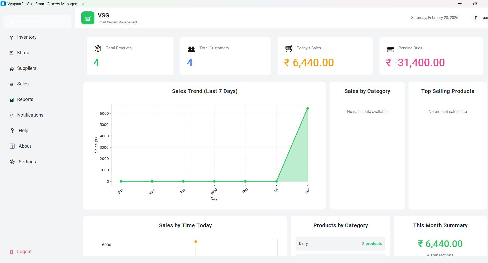
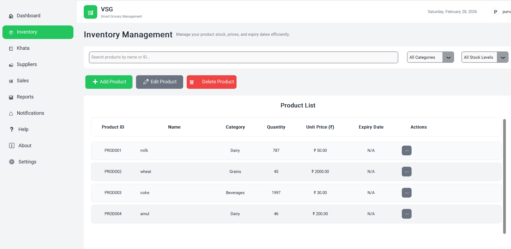
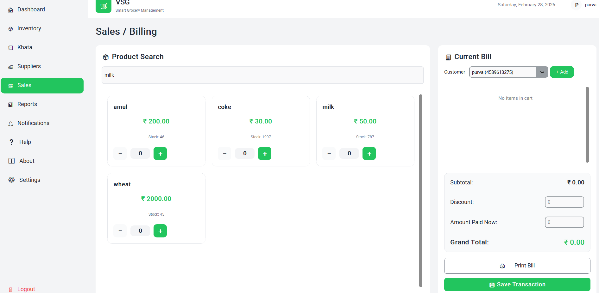

# VyapaarSetGo - Smart Grocery Management System

VyapaarSetGo is a production-ready Smart Grocery Management System built as a full-featured desktop application using Python and CustomTkinter.

Designed to streamline grocery store operations, VyapaarSetGo provides inventory tracking, billing automation, supplier management, customer credit tracking (Khata), and powerful reporting — all within a modern, responsive desktop interface.

This project demonstrates real-world business logic implementation, modular architecture design, and local database management 

using SQLite.
](image.png)
## Why VyapaarSetGo?

Small and medium grocery businesses often struggle with:

- Manual stock tracking
- Unstructured credit management
- Inconsistent sales reporting
- Lack of digital record keeping

VyapaarSetGo solves these problems through:

- Automated stock updates during billing
- Structured supplier and customer management
- Insightful sales analytics
- Secure multi-user access

## Features

- **Login System**: Secure authentication for shop owners
- **Dashboard**: Overview with key metrics and sales trends
- **Inventory Management**: Add, edit, delete products with stock tracking
- **Supplier Management**: Manage suppliers and track pending payments
- **Customer Khata**: Track customer credit accounts and payment history
- **Sales/Billing**: Create bills, process transactions, and update stock automatically
- **Reports**: Daily/monthly sales reports with charts and analytics

## Requirements

- Python 3.8 or higher
- Required Python packages (see requirements.txt)
- **No database server needed!** SQLite is built into Python

## Installation

1. **Clone or download this repository**

2. **Install Python dependencies:**
   ```bash
   pip install -r requirements.txt
   ```

3. **Run the application:**
   ```bash
   python main.py
   ```

   The application will automatically create the SQLite database file (`vyapaarsetgo.db`) and all required tables on first run.

## Default Login Credentials

- **Username:** `admin`
- **Password:** `admin123`

⚠️ **Important:** Change the default password in production!

## Project Structure

```
VyapaarSetGo_02/
├── main.py                 # Main application entry point
├── database.py             # SQLite database connection and operations
├── config.py               # Configuration and constants
├── requirements.txt        # Python dependencies
├── vyapaarsetgo.db         # SQLite database file (created automatically)
├── components/             # Reusable UI components
│   ├── sidebar.py         # Sidebar navigation
│   └── header.py          # Application header
└── modules/                # Application modules
    ├── login.py           # Login module
    ├── dashboard.py       # Dashboard module
    ├── inventory.py       # Inventory management
    ├── suppliers.py       # Supplier management
    ├── khata.py           # Customer credit book
    ├── sales.py           # Sales and billing
    └── reports.py         # Reports and analytics
```

## Usage

1. **Login**: Use the default credentials or create a new user in the database
2. **Dashboard**: View key metrics and sales trends
3. **Inventory**: Add products, manage stock, track expiry dates
4. **Suppliers**: Add suppliers and track pending payments
5. **Khata**: Manage customer credit accounts and record payments
6. **Sales**: Create bills, add products to cart, process transactions
7. **Reports**: View daily/monthly sales reports with charts

## Database

The application uses **SQLite**, which means:
- ✅ No database server installation required
- ✅ Database is stored in a single file (`vyapaarsetgo.db`)
- ✅ Easy to backup (just copy the .db file)
- ✅ Works on Windows, Mac, and Linux
- ✅ Automatic database and table creation on first run

The application creates the following tables:
- `users` - User accounts
- `products` - Product inventory
- `suppliers` - Supplier information
- `customers` - Customer information
- `sales` - Sales transactions
- `sale_items` - Individual items in each sale
- `payments` - Customer payments
- `supplier_payments` - Supplier payments

## Features in Detail

### Inventory Management


- Add/edit/delete products
- Track quantity, unit price, and expiry dates
- Search and filter by category and stock level
- Automatic stock updates on sales

### Sales/Billing

- Search products by name or ID
- Add products to cart with quantity selection
- Apply discounts
- Automatic stock deduction
- Transaction ID generation

### Reports
- Daily, monthly, and custom date range reports
- Sales overview line chart
- Profit trend bar chart
- Detailed transaction data table

## Customization

- **Colors**: Modify `COLORS` dictionary in `config.py`
- **Database Path**: Change `DB_PATH` in `config.py` if you want a different database file location
- **UI Theme**: Change appearance mode in `config.py`

## Troubleshooting

1. **Database Connection Error:**
   - Ensure you have write permissions in the application directory
   - Check if the database file is locked by another process

2. **Import Errors:**
   - Make sure all dependencies are installed: `pip install -r requirements.txt`
   - Check Python version (3.8+)

3. **UI Not Displaying:**
   - Ensure CustomTkinter is properly installed
   - Check for any error messages in the console

## Backup

To backup your data, simply copy the `vyapaarsetgo.db` file to a safe location. To restore, replace the file with your backup.

## Built With

- Python 3.8+
- CustomTkinter (Modern UI Framework)
- SQLite (Lightweight Local Database)
- PyInstaller (Windows Executable Packaging)

## Architecture Overview

VyapaarSetGo follows a modular desktop application architecture:

- **main.py** – Entry point and application controller
- **database.py** – Centralized SQLite CRUD operations
- **modules/** – Feature-based modules (inventory, sales, reports, etc.)
- **components/** – Reusable UI components (sidebar, header)
- **config.py** – Theme management and configuration

This structure ensures scalability, maintainability, and separation of concerns.

## Project Purpose

VyapaarSetGo was developed to simulate a real-world grocery ERP system and demonstrate end-to-end desktop application development, including authentication, database management, billing logic, and reporting systems.

## Support

For issues or questions, please check the code comments or create an issue in the repository.

---

**VyapaarSetGo** - Smart Grocery Management System © 2025
